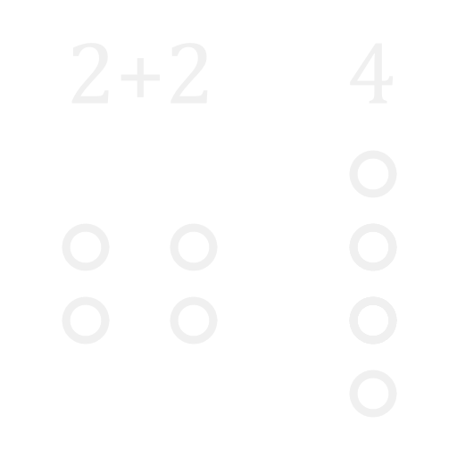
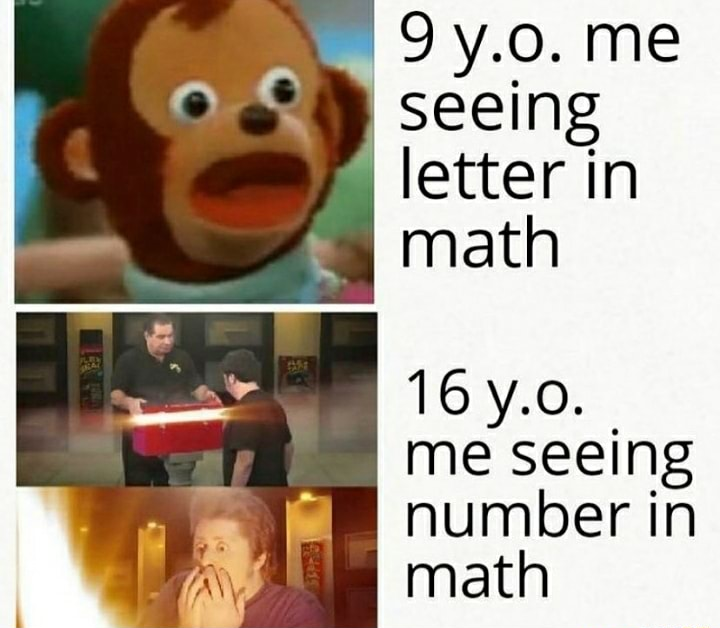
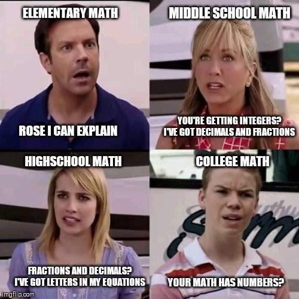

+++
title = "Equality and the reunion of broken parts"
description = ""
date = "2024-02-14T21:43:18+01:00"
tags = ["", ""]
categories = ["", ""]
draft = true
+++
We are used to think that the word "equals" means something very specific in mathematics. I can put an operation on the left side of the page, like this:

\[2 + 2\]

And then I can _ask you what this is equal to_:

\[2 + 2 =\]

That symbol, called the "equal sign", is treated like a question mark. What is on its left forms a question, and then you put your answer on the right.

\[2 + 2 = 4\]

But this is very different than how we use the word in a conversation. We say that two things are "equal" when they are identical, or more loosely when they're very similar.

Two objects with the same shape, color and size are equal; two identical twins are equal, two copies of the same photograph are equal. "Equal" is synonym with "equivalent" and "uniform".

How did a word that describes the _relationship between two things_ became a _request for an answer to be given_?

Answer: it didn't.

Just like in natural language (english, italian, etc) equals simply indicates a property that two objects might have: that they are equivalent.

In the case of \(2 + 2 = 4\), the objects are numbers. Since "2 + 2" and "4" are both numbers, I can talk about what the relationship is between them: they are the same number, simply expressed in two different ways.

This is powerful. Knowing two ways to write the same thing means that I can choose the one that's more convenient to the situation. I can look at this complicated expression and rewrite it more concisely by changing the "2 + 2" notation with the "4":

\[\frac{{(2+2)}^{\mbox{complicated stuff}}}{\mbox{complicated stuff}}=
  \frac{{(4)}^{\mbox{complicated stuff}}}{\mbox{complicated stuff}}\]

I can also do the opposite: take a succint expression and expand it into a bigger one:

\[\root{}\of{\frac{\mbox{complicated stuff}}{{ln}^2(4)}}=
  \root{}\of{\frac{\mbox{complicated stuff}}{{ln}^2(2+2)}}\]

If this feels like it's bringing you _further away from the result_, you're still thinking about "2 + 2" and "4" as a question and an answer.

But why make something look more complicated than it is? Don't mathematicians like simple things?

Suppose we wanted to compare these two quantities:

\[1 \hspace{35pt} \frac{\sqrt{3}}{2}\]

I want to know which of them is bigger. One way to do it would be to "simplify" the number on the right: take out the calculator, take the square root of 3, then divide by 2. But what if you don't have a calculator? Equality to the rescue!

We can rewrite 1 as \(\frac{2}{2}\) (we can because they're _equal_):

\[\frac{2}{2} \lessgtr \frac{\sqrt{3}}{2}\]

Now we have two fractions with the same denominator, which means their relationship only depends on the numerator:

\[2 \lessgtr \sqrt{3}\]

We also know that the square of 2 is 4, so that becomes:

\[\sqrt{4} \lessgtr \sqrt{3}\]

And the square root of 4 is certainly greater than that of 3. With this, we can conclude, without any calculator nor approximations, that \(1 > \frac{\sqrt{3}}{2}\).

When we study algebra in Middle and High School, so much focus is put on the "reunion of broken parts". So many exercises in which we're required to simplify complicated expressions, to which we're supposed to answer with a number in its "canonical" representation. After all, that's what the word "algebra" means: to put the pieces together.

But just as valid, and perhaps more difficult (since it requires creativity, contrary to the simplification which can often be done automatically by a computer) is doing that in _reverse_: taking a contraction and extrapolating useful information by finding a different way to represent it.

If you are in the mood to pause the reading and do some thinking, you can try it now:

- Which is larger, \(\frac{3}{\sqrt{\pi}}\) or \(1\)?

- Imagine a square and two circles; one of them is smaller, and touches exactly the midpoints of the square's sides; the other, larger, passes through the four corners of the square.

<drawing>

Is the length of the inner circumference larger or smaller than half the length of the outer circumference?

If you find yourself stuck and want to excercise you creative muscles, you can do this one instead:

- Using less than 10 symbols, what is the scariest way to write the number 0?

Well done, welcome back. You may keep reading now.

Actually, let's do one more: which is larger?

\[2 + 2 \hspace{25pt} 4\]

Interesting. We went from the equals sign being the request for an answer, to it being _the_ answer. At the same time, "4" became part of the question itself.

What am I trying to say?

For a long time, I have been under the impression that _math_, and specifically _algebra_, is about _numbers_. I am not alone in this — in fact, many people _still believe_ that, despite being older than me. Whenever there is a question that involves numbers — like how much does each person pay if there's 4 of us and the total is $50.46 — they say _"I can't do it, I was never good at math"_. They populate the internet with memes like this:

To be fair, they are not _entirely_ wrong. Numbers play a big role in mathematics, but they are not the aim of it.

One way to interpret the phrase "reunion of broken parts" as the meaning and ethimology of algebra is to call the different pieces of an expression, and say that the objective is to put all those pieces together. In our earlier example, the two \(2\)s are the _parts_, and the \(4\) is their _reunion_.

Recently I came up with another interpretation that I like a lot more. The "broken parts" are whichever abstract ideas you want — numbers, lines, triangles, motions in a space, even alphabets and languages — and the "reunion" is the discovery that, sometimes, two of those things that looked very different are, in fact, the same thing.

Our example is getting boring, but just to make things clear: it is possible to view all three numbers (the two \(2\)s and the \(4\)) as the broken parts, and their _relationship of equality_ as the reunion.

I don't know if there is an "official" or "correct" interpretation of this phrase, but I like to think as the second one as a better description of what algebra is actually about: finding relationships between seemingly unrelated things.

And, as I said, these "things" don't have to be numbers. They can be — as in out \(2+2\) example — but they can also be shapes (like how [rectangles can be sliced and rearranged to form a new one](https://emanuelerovini.wordpress.com/2023/10/18/intuition-for-factorization/)) or transormations (like how [sometimes transforming a whole space has the same effect as simply scaling a direction](https://www.youtube.com/watch?v=PFDu9oVAE-g)).

Just like the _parts_ aren't always numbers, the _reunion_ doesn't always have to be _equality_. An equally interesting discovery might be that two things are _not_ equal. One could then go on and discuss _how_ are they not equal — which one is greater, and which is smaller? Does it even make sense to ask this question, or are they simply not comparable? — or even whether they are equal only _sometimes_.

The more I progress in my math education, the more I realize that the things I (we) used to call "results" are very different to those which a mathematician might give the same name. For me, a "result" might have been the area of a geometric shape, the solution to an equation, the symbolic expression for the derivative of a function.

These aren't the kinds of results that mathematicians are after. What they seek is a deep, complete understanding of the various ideas that compose the human imagination. A result is a theorem, a statement that says "there is an infinite number of these", or "there can be only one". A result might be, for example, the answer to the question: _"are these two things equal?"_
