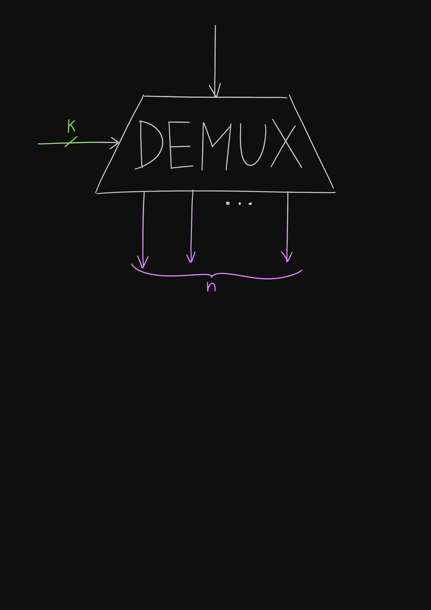

+++
title = "Lies, Secrets and Multiplexers"
description = "About Multiplexers, and a simple analogy that helped me understand how these digital circuits work."
date = "2024-03-02T19:26:55+01:00"
tags = ["", ""]
categories = ["Hardware", "Digital Logic"]
draft = true
+++

You are on a street, one person coming towards you from your right, another from your left. You know that, when they will have reached you, one of them will tell the truth and one will lie. To know which one will do what, you only need the answer to one yes-or-no question; in computer terms, you need _1 bit of information_ to choose which person to trust. It doesn't matter if you ask "should I trust the person coming from the right?" or "should I trust the one coming from the left?", both questions have 1-bit answers.

Then, you find yourself in the middle of a crossing, with a person coming from each cardinal direction: one from south, one from east, one from north, and one from west. Only one of them will tell the truth, the other three will not. This time, a single question won't be enough: you first need to _exclude half the possibilities_ by asking something like "should I trust the person coming from the direction parallel to the equator?", and then nail it down to only one possible direction. You need not 1, but _2 bits of information_.

This can be generalized:

Seeing it the other way,

This is what the digital circuit called the *multiplexer* does: in its case, the "people" coming from different directions are wires, and its job is to pick the one that will carry through to its output based on the control bits it receives as a secondary input.

Note that the primary inputs - the "people" - don't need to be 1-bit wide; they can carry an arbitrarily large amount of information, and the multiplexer couldn't care less. It doesn't have to interpret the information in any way, all it has to do is choose the right source. What matters is the _amount_ of primary inputs - that's what determines how many control bits are required.

Your computer uses a multiplexer when, for example, it wants to _read_ from a register: each register has wires attached to it, continuously carrying its contents; but the CPU asked for a specific one, so a multiplexer will use the index of the register as its control bits and select the right data.

But what if your computer wanted to, instead, _write_ to a register?

You can imagine yourself in that street again, but with the roles reversed: you, the sole connoisseur of the truth, surrounded by people, each one about to go in a different direction. Only one of them is allowed to know the secret and to bring it to a new place. _Everyone else shall remain ignorant. But who shall the chosen one be?_

You can use the same method (and math) as before: repeatedly divide by two. A *demultiplexer*, as the name implies, does the opposite job of a multiplexer: it takes its one primary input, and uses the control bits to choose _which of the outputs_ to forward the input to. All the other outputs will be zeros.

We can now take advantage of the fact that, every clock cycle, each register receives a 1-bit signal called the write-enable that tells it whether it should update itself with the data it receives. When the CPU wants to write to a register, it can just send the data to all the registers. Then, a demultiplexer will set the write-enable bit of the selected register to 1, leaving all the others to zero, thus only allowing the chosen register to update.

Muxes and demuxes [have other uses](https://en.wikipedia.org/wiki/Multiplexer), and they are a fundamental part of how a computer's hardware works. Hopefully, with this analogy, you will be able to have a general idea of what their purpose is. You could even try to [implement one yourself](https://circuitverse.org/simulator) by combining together logic gates!
