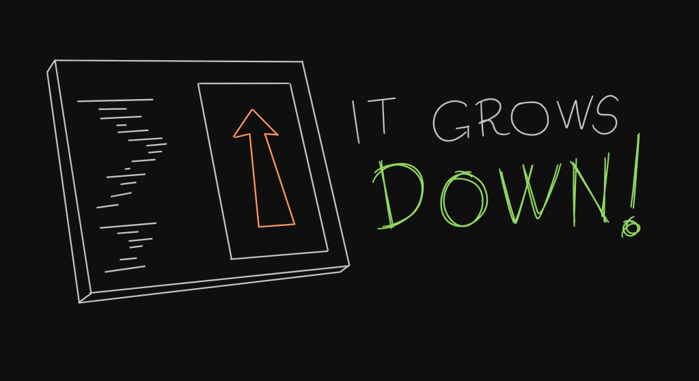
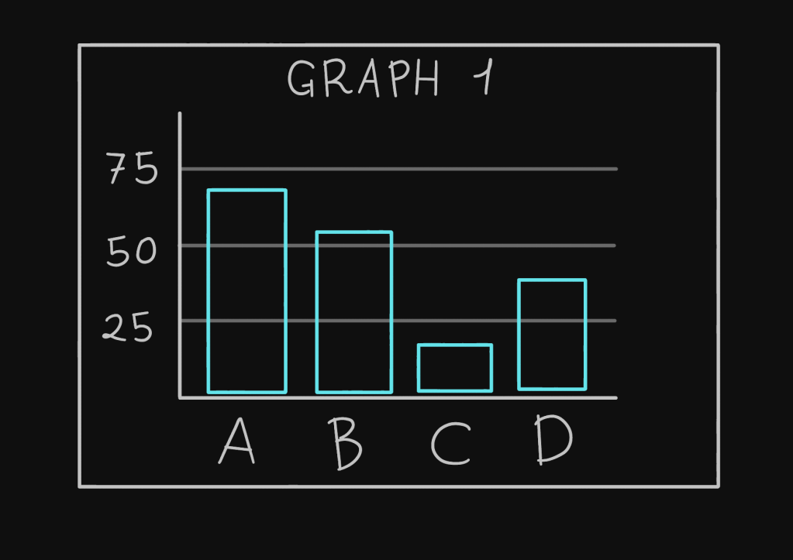
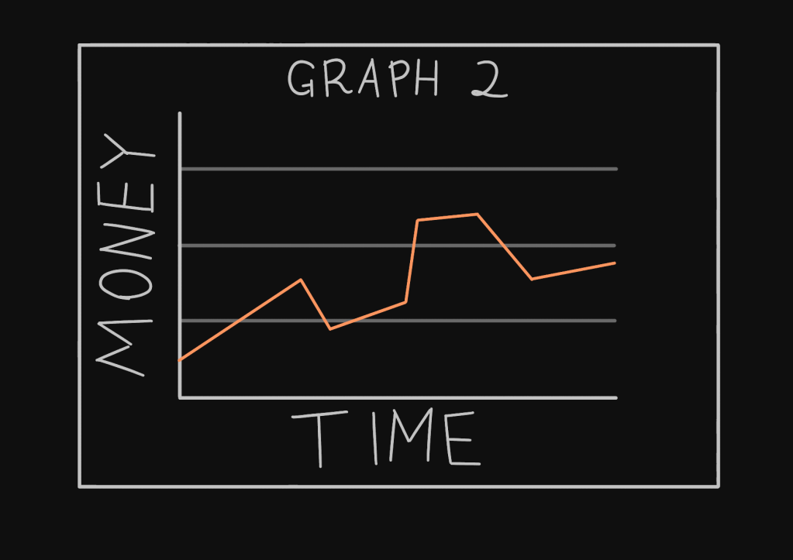
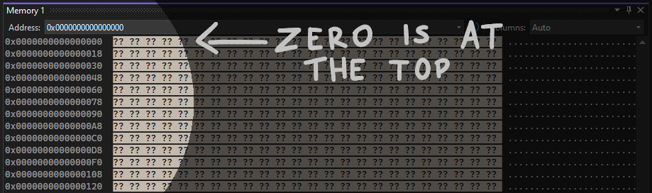
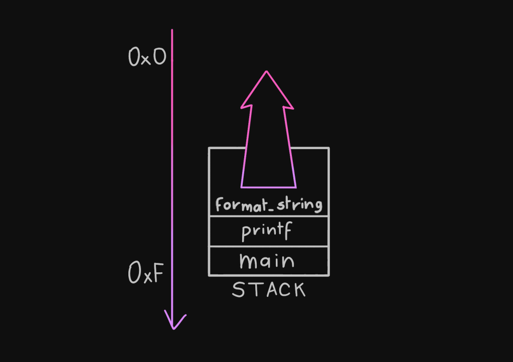

+++
title = 'Program Stacks in a World of Upside Downs'
date = 2023-10-11T12:30:00+01:00
draft = true
+++
If you've ever had someone explain to you how the program stack works, they probably told you that it usually _grows downwards_. If those two words next to each other weren't weird enough - isn't growing sort of a synonym of going up? - they then immediately start to draw a diagram of the computer's memory, and they stick in it an arrow _pointing up_.

So as the stack grows, it goes down, and we indicate it by pointing up. Oh, isn't programmer terminology amazing. Let’s try to make it make sense.

When a program is launched, its stack pointer register has a certain value x. As the program runs, it will need to _make space_ for local variables. Regardless of whether the stack pointer is increased or decreased, the stack “grows” (similarly, when the space for local variables is freed, the stack “shrinks”).

They’re two different kind of growths: one is numerical – being closer or farther away from zero – and one conceptual – being able to “hold” more or less data.

None of these growths have anything to do with going towards a specific direction. Main memory is just a box in your computer, it doesn't know what up, down, left or right mean. All it knows is that every byte in it is assigned a number, starting from 0 all the way to some power of 2. It communicates with the CPU by receiving numbers, and sending back numbers.

But we’re humans, and we’re not good with numbers. We like to visualize things. We put numbers on graphs to understand them better.

[TODO: Put them side by side.]

The general convention seems to be that _up means big, down means small_.

At the same time, though, most cultures write and read from top to bottom (early scribes wanted to rest their hand on the page without smearing all the ink). It's ingrained in our brains that the _beginning_ of something is at the top; but to go up, also means to be further away. As you’ve seen, it depends on the context.

When you see the “stack arrow” pointing up, while hearing that it goes down, it’s not a contradiction. Usually that arrow is a representation of the values assumed by the stack pointer as you would write them on a piece of paper, or see them in the memory window of a debugger.

When you put 0 at the top of the screen, higher addresses will be below it. If to move _down_ means to move _towards zero_, then the _bottom_ will be where 0 is, which means up at the _top_. In other words, if we place memory addresses on a graph, the y axis should be flipped.

I hope this way of seeing it clears up some confusion, if there was any. Programmers will throw out terms like it’s no big deal, but this has been confusing me for a long time. This is only half the story – I still need to make peace with _endianness_ related orderings – but let’s tackle one thing at a time.
