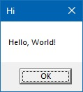

+++
title       = 'Windows programming part 1: displaying a message box'
description = ''
date        = '2024-12-18T11:29:43+01:00'
tags        = ['', '']
categories  = ['']
draft       = true
+++

This article explains how to create a Windows program that displays a message box like the following. I call this the _Minimal Windows Program_&trade;, or _Hello Windows_.





Such a simple program is ideal because it touches many topics and is useful for creating a foundation of Windows-related knowledge.

The whole program is made out of a single function call. It'll be something like this:

    main :: () {
        show message box(...)
    }

However, everything *around* that single call is what makes this worth talking about.

## The MessageBox function/macro

Let's start by looking at the signature of the function itself. You can find it [in the docs](https://learn.microsoft.com/en-us/windows/win32/api/winuser/nf-winuser-messagebox), but I'll report it here for convenience.

```C
int MessageBox(
  [in, optional] HWND    hWnd,
  [in, optional] LPCTSTR lpText,
  [in, optional] LPCTSTR lpCaption,
  [in]           UINT    uType
);
```

If you've never called a Windows function before, there are a few things that might catch your attention.
First of all, the parameter names are all prefixed with one or two letters. Instead of just "Text", we have "lpText". Instead of "Type", it's "uType". What's up with that?
Secondly, the _types_ of the parameters are different than the ones you are used to.
Third, you might see that some of these parameters are labeled as "optional", and all of them are labeled as "in". What does it mean?

Lastly, and _most importantly_, this function comes in _three_ versions:

- MessageBox
- MessageBox*A*
- MessageBox*W*

What's the difference? What do those suffxes "A" and "W" mean?

Let's start from the easy ones. A lot of Windows functions take in _optional_ arguments in the form of zeros. You can pass `0`/`NULL` in place of an argument marked as _optional_, and it'll be replaced with a default value.
This means that `MessageBox` can be called like this:

```C++
MessageBox(0, 0, 0, 0);
```

The first three parameters will be replaced internally with default values.

The deal with parameter _names_ is called [hungarian notation](). It's the practice of annotating every variable with a prefix that indicates the type of the variable. So an int variable representing a length will be called `nLength`, a pointer to a value will be called `pValue`, and so on.

In this case, we have:

```C++
hWnd         // A 'handle' to a window
lpText       // A 'long pointer' to some text
lpCaption    // A 'long pointer' to a caption
uType        // An 'unsigned int' type
```

A big part of the Windows API uses this convention, so you better get used to it.

## Windows data types

The _types_ of the parameters are defined in a windows header called `BaseTsd.h`. You can check [this documentation page]() for a list of all the types defined there and their definition.

If you scroll through the list, you might see that most of the types are just alternate names for the builtin C types.

For example, `UINT` is just an unsigned 32-bit integer. It is equivalend to `unsigned int`. Why define a new name for an existing type? I don't know, but Windows loves to do that.

A `HWND` is simply a `void *`. It is one of the many types of "handles" that Windows defines. Whenever windows creates a resource that needs to be opaque, it will often return a "handle" to it. The details of how this handle works are unknown, and that's the point: you're not supposed to care about how this handle is interpreted, windows will know.

There are many types of handle: `HWND` (handle to a window), `HBRUSH` (handle to a brush), `HCURSOR` (handle to a cursor), and so on.

Finally, `LPCTSTR`. I left this one for last because it the most complicated to unpack. Starting from the easy parts, "STR" is short for "string". So this type is a kind of string.
"LP" is an acronym for "Long Pointer". In this case, it doesn't mean anything - it's simply describing how strings are represented in C programs: as pointers to the actual data.
So this is a pointer to a string, or simply a string. If you search in the `BaseTsd.h` header, you will find a "LPSTR" type, which is just a "char *"

"C" stands for "Constant". It's saying that the string in question has the "const" qualifier. The `BaseTsd.h` header also has a the `LPCSTR` type, defined as "const char *"

We're left with the T. To explain this, we're going to have to take a quick detour into the windows headers. Feel free to follow along.

## Into the headers

In Visual Studio, create an new empty C++ solution/project.
In a `.cpp` file, write the following code:

```C++
#include <windows.h>

int main() {
    MessageBox();
}
```

The header `windows.h` is a wrapper header that contains most of the basic Windows functionality. It includes other headers such as `BaseTsd.h` (which we saw earlier) and `Winuser.h` (where `MessageBox` is defined).

Right-click on `MessageBox`, then click on 'View Definition'. It should open a new tab called `winuser.h`, right to the line where `MessageBox` is defined.

```C++
#ifdef UNICODE
#define MessageBox  MessageBoxW
#else
#define MessageBox  MessageBoxA
#endif // !UNICODE
```

As you can see, `MessageBox` is not actually a function, but rather a _macro_. It expands to either the *A* or the *W* version depending on some `UNICODE` symbol.

This is a little historical artifact. If you want to know more about the history of this choice, [scroll to the bottom/watch Casey explain it]. What remains of it today is a hack to encourage new programs to use Unicode strings while still remaining backwards-compatible with programs that were written using ASCII strings.

The 'A' and 'W' suffixes stand, respectively, for 'ANSI' and 'Wide'. They indicate wether the strings that they operate on are _narrow_ or _wide_:

[Image/diagram explaining the difference between narrow/wide strings]
[Caption: How narrow and wide strings are encoded]

If we read the signatures of the two functions and the definitions of the types of their parameters, we can see that they differ exactly on the string type:

    MessageBoxA(HWND, LPCSTR,  LPCSTR,  UINT);
    MessageBoxW(HWND, LPCWSTR, LPCWSTR, UINT);
                      ^--------------^

Where:

    LPCSTR  = const char *
    LPCWSTR = const wchar_t *

So if your program is always going to output ANSI strings, you can just go with the A version and pass in regular strings. But how do we define wide strings?
If you're using C or C++ you can add a `L` prefix in front of any string literal to tell the compiler to treat it as a wide string:

    LPCWSTR message = L"Message text";
                      ^

For other languages, you have to hope that the compiler has a similar feature. In Odin, for example, the `L` prefix is replaced with a compiler intrinsic that
does the same thing:

    message := windows.L("Message text");
               ^-------^

We're almost there. So, having said all this, what is the "T" in `LPCTSTR`?
It's all part of the same hack. The people at Microsoft decided they wanted developers to be able to switch between narrow and wide strings easily, without having to change every string literal, type and function call. So they defined a "TEXT" macro, which expands to either one of the two string literals depending on the presence of a symbol:

```C++
#ifdef UNICODE
#define TEXT(s) L##s
#else
#define TEXT(s) s
#endif // !UNICODE
```

You use it like this:

```C++
LPCTSTR message = TEXT("Message text");    // Expands to L"Message text" if UNICODE is defined, to "Message text" otherwise.
```

The `LPCTSTR` type is designed to caputure whatever type comes out of the `TEXT` macro. The "T", of course, stands for "TEXT". I'll put it here for completeness:

```C++
#ifdef UNICODE
typedef LPCWSTR LPCTSTR
#else
typedef LPCSTR LPCTSTR
#endif // !UNICODE
```

So there you have it. If you *always* write code using the `TEXT` macro, and the `LPCTSTR` type, and the macro wrappers for functions, you'll be able to switch between narrow and wide strings every time you compile the program.

## The program and a few other things

Let's put everything together and write the program.

```C++
/* C */
#include <windows.h>

int main(void) {
    MessageBoxW(NULL, L"Hello, Windows!", L"Message", MB_OK);
}
```

```Odin
/* Odin */
package main

import "core:sys/windows"

main :: proc() {
    windows.MessageBoxW(nil, windows.L("Hello, Windows!"), windows.L("Message"), windows.MB_OK);
}
```

If you did everything correctly, it should display a message box, like one of the two below:

[2 screenshots of the two versions of the message box]
[Caption: The two possible results of the program. Note: The screenshots were taken on Windows 10. If you're using another version of windows, the message box might appear even more different!]

Now, of course we aren't done. Why would it be like "one of the two below"? Shouldn't the result be the same for everybody? Is there a way to _choose_ the appearance of the message box?
Oh, and also, if I run the program from the command line, the console become unresponsive; while if I run it by double-clicking on the icon, a new console opens up. Why?

You will have an answer to all these questions, *but* at this point you should just have some fun. Go back to the documentation, look into the other possible values for the 'uType' parameter, look at what the function returns and do something based on it. You can now make message boxes appear on screen! Use this new superpower!

If you're ready to tackle the rest, read on.

todo:
- note that MB_OK = 0
- note that text in buttons will be translated to the system's language (italian, french, etc)
- the point of this article is not to explain EVERYTHING there is to know about message boxes; for that, there is documentation. The point is to notice all the things that would be confusing or difficult to figure out, not mentioned in the docs.
- MessageBeep
- Note: always keep a Sample VS Solution when doing windows programming
- then: windows subsystems, WinMain, the /entry and /subsystem flags
- visual styles, side-by-side assemblies
